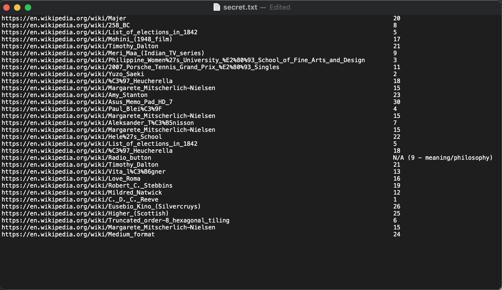

# Wiki Game

This challenge was designed to test web scraping and scripting abilities as well the utilization of a number cipher.

## Overview

As part of the challenge, the user is given a file containing a list of 32 wikipedia pages, and a link to the wikipedia article describing the parameters of this concept. Upon reading the article, the user would learn that almost any wikipedia article starting point can lead to the philosophy wikipedia page strictly by clicking the first link on each page. It also defines the specifications for what the "first link" entails.

## Converting Links to Numbers

Upon receiving the list of wikipedia articles, the user must work on converting these to numbers. This can be done in one of two ways. The first involves the user manually clicking through each link, counting how many links it takes to reach philosophy and recording that number. This is the approach that I took and the results are shown below.

